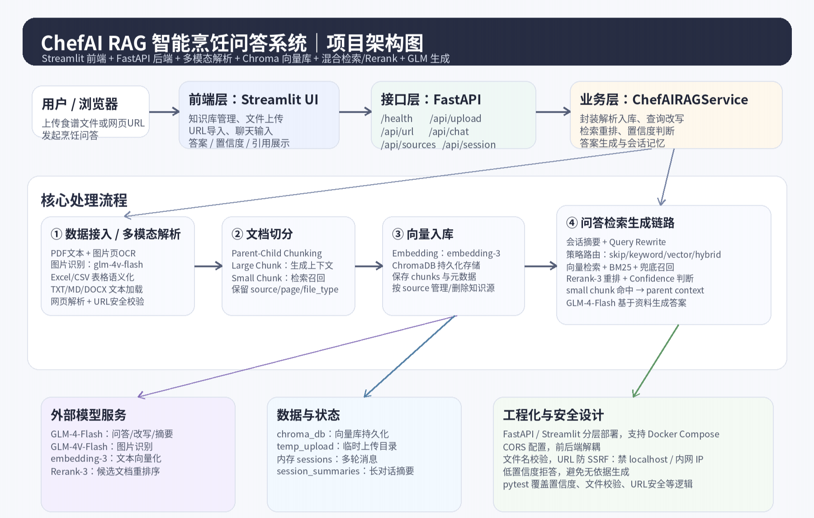
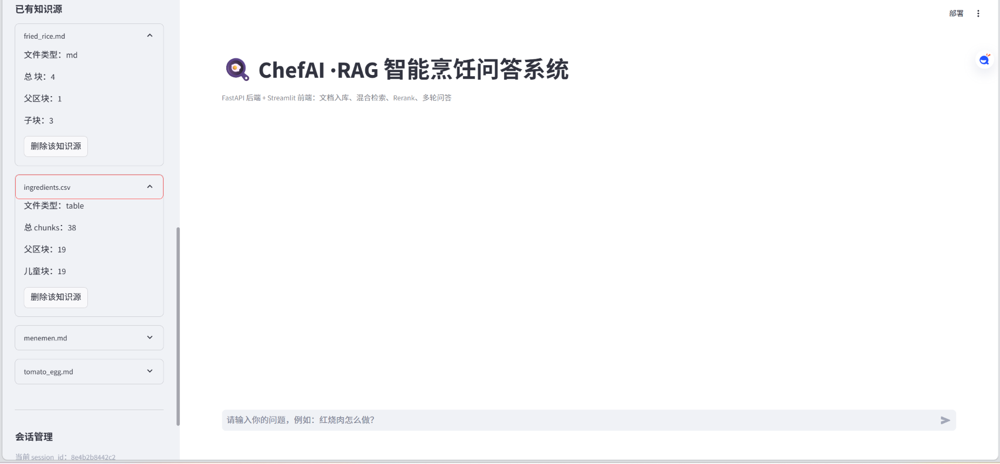
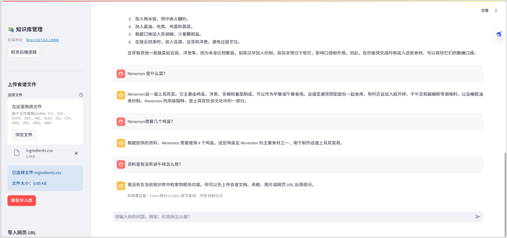

# ChefAI · 垂直领域 RAG 知识库问答系统

基于 **FastAPI + Streamlit + ChromaDB + GLM** 构建的垂直领域 RAG 知识库问答系统，支持多格式资料入库、混合检索、Rerank、多轮 Query Rewrite、低置信度拒答、引用溯源与 RAG 评估优化。

本项目以食谱 / 烹饪资料作为垂直知识场景，重点验证 RAG 应用从资料解析、知识库构建、检索增强问答到评估优化的完整流程。

---

## 1. 项目简介

ChefAI 是一个面向食谱和烹饪知识的 RAG 问答系统。用户可以上传食谱文档、表格、图片或导入网页 URL，系统会对资料进行解析、切分、向量化并写入 ChromaDB 知识库。用户提问后，系统通过向量检索、BM25 关键词检索、Rerank 重排序和低置信度判断生成回答，并展示引用来源。

本项目重点不是单纯调用大模型 API，而是围绕一个完整 RAG 应用完成：

- 多格式资料入库
- 文档切分与向量化
- Vector + BM25 混合检索
- Rerank 重排序
- Parent-Child Chunking
- 多轮 Query Rewrite
- 低置信度拒答
- 引用来源展示
- RAG 评估集构建与优化前后对比

---

## 2. 项目截图

### 2.1 系统架构



系统采用 **Streamlit 前端 + FastAPI 后端 + ChromaDB 向量库** 的分层架构。核心链路包括资料解析、文档切分、向量入库、混合检索、Rerank、Query Rewrite、低置信度判断和答案生成。

### 2.2 知识库管理与资料入库



系统支持多类型资料入库，并在侧边栏展示已导入知识源、文件类型、chunk 数量和删除入口，方便管理不同来源的知识资料。

### 2.3 问答与拒答演示



系统支持基于知识库的问答与低置信度拒答。当用户询问知识库外问题时，系统会提示当前知识库中未提供相关内容，降低模型基于常识直接编造答案的风险。

---

## 3. 技术栈

| 模块 | 技术 |
|---|---|
| 前端 | Streamlit |
| 后端 | FastAPI |
| 语言 | Python |
| 向量数据库 | ChromaDB |
| 检索 | 向量检索、BM25、Hybrid Search |
| 重排序 | Rerank |
| 大模型 | GLM |
| 文档处理 | PDF、Word、Excel、CSV、Markdown、TXT、图片、网页 URL |
| 工程化 | Docker、docker-compose、Pytest |
| 评估 | 50 条中文 QA 评估集、Answer Correctness、Faithfulness、Refusal Correctness |

---

## 4. 核心功能

### 4.1 多格式资料入库

系统支持导入多种资料类型：

- PDF
- Word
- Excel
- CSV
- Markdown / TXT
- 图片
- 网页 URL

对于结构化表格资料，系统会进行表格文本化处理；对于图片或扫描类资料，可结合视觉模型进行内容提取。

### 4.2 Parent-Child Chunking

系统使用 Parent-Child Chunking 方案：

- **small chunk**：用于精准检索，提高匹配粒度；
- **parent chunk**：作为生成上下文，保证回答完整性。

这种方式用于缓解普通 chunk 过短导致上下文不完整、chunk 过长导致检索不精准的问题。

### 4.3 混合检索

系统支持：

- 向量检索
- BM25 关键词检索
- Hybrid Search
- Rerank 重排序

对于不同类型的问题，系统会进行检索策略分流，例如普通问答、关键词型问题、步骤类问题和多轮追问问题会采用不同检索组合。

### 4.4 多轮 Query Rewrite

系统支持多轮对话记忆，并对指代类问题进行 Query Rewrite，例如：

```text
用户：Menemen 是什么菜？
用户：它需要几个鸡蛋？
```

系统会将第二个问题改写为更明确的检索查询：

```text
Menemen 需要几个鸡蛋？
```

为了减少历史上下文污染，当前版本只对明显指代类问题进行改写，不对所有问题强制改写。

### 4.5 低置信度拒答

系统会根据检索结果和置信度判断是否回答。

当知识库中没有相关资料时，系统会拒答，例如：

```text
当前知识库中未提供相关内容。
```

该机制用于减少知识库问答中的资料外扩展和模型幻觉。

---

## 5. RAG 评估与优化

### 5.1 评估集设计

项目构建了 50 条中文 QA 评估集，覆盖以下问题类型：

| 类型 | 说明 |
|---|---|
| 食材查询 | 测试基础事实召回 |
| 步骤问答 | 测试烹饪步骤类问题 |
| 细节判断 | 测试具体条件、时间、作用类问题 |
| 相似菜品对比 | 测试相似资料区分能力 |
| 多轮追问 | 测试 Query Rewrite 和上下文理解 |
| 知识库外拒答 | 测试低置信度拒答能力 |

### 5.2 评估指标

本项目采用人工评估方式，主要记录以下指标：

| 指标 | 含义 |
|---|---|
| Answer Correctness | 回答是否命中标准答案 |
| Faithfulness | 回答是否忠实于知识库资料 |
| Refusal / Negation Correctness | 知识库外问题或否定类问题是否正确处理 |

### 5.3 优化前后结果

| 指标 | 优化前 | 优化后 |
|---|---:|---:|
| Answer Correctness | 0.84 | 0.89 |
| Faithfulness | 0.47 | 0.91 |
| Refusal / Negation Correctness | 0.60 | 1.00 |

### 5.4 优化内容

根据首轮评估结果，系统主要暴露出两个问题：

1. 回答中存在资料外扩展，例如把资料没有明确写出的常识补充进答案；
2. 知识库外问题有时没有严格拒答，例如根据模型常识回答资料中不存在的问题。

针对这些问题，进行了以下优化：

- 收紧生成 Prompt，要求只基于检索资料回答；
- 对“根据资料 / 有没有提到 / 是否必须”类问题增加严格判断规则；
- 优化低置信度拒答逻辑，避免知识库外问题直接使用模型常识回答；
- 调整 Query Rewrite 逻辑，仅对明显指代类问题进行改写，降低历史上下文污染风险；
- 修复 Rerank 不可用时导致过度拒答的问题。

### 5.5 评估说明

本评估基于小规模中文 QA 数据集，主要用于验证个人项目中的 RAG 优化流程。由于测试资料规模有限，评估结果不能代表生产环境表现，也不等同于通用 RAG Benchmark 结果。

---

## 6. 项目结构

```text
chefai-rag/
├── backend/              # FastAPI 后端接口
├── frontend/             # Streamlit 前端页面
├── memory/               # 多轮会话与 Query Rewrite
├── parsers/              # 文档、表格、图片、网页解析
├── retrieval/            # 混合检索与 Rerank
├── vectorstore/          # ChromaDB 向量库相关逻辑
├── evaluation/           # 评估相关脚本或记录
├── eval/                 # 评估集与评估结果
├── docs/                 # 架构图、项目截图
├── tests/                # 单元测试
├── config.py             # 配置文件
├── requirements.txt      # Python 依赖
├── Dockerfile
├── docker-compose.yml
├── .env.example
├── .gitignore
└── README.md
```

---

## 7. 本地启动

### 7.1 克隆项目

```bash
git clone https://github.com/你的用户名/chefai-rag.git
cd chefai-rag
```

### 7.2 创建虚拟环境

```bash
python -m venv .venv
```

Windows：

```bash
.venv\Scripts\activate
```

macOS / Linux：

```bash
source .venv/bin/activate
```

### 7.3 安装依赖

```bash
pip install -r requirements.txt
```

### 7.4 配置环境变量

复制 `.env.example` 为 `.env`：

```bash
cp .env.example .env
```

Windows 可直接手动复制文件并重命名为 `.env`。

示例：

```env
GLM_API_KEY=your_api_key_here
EMBEDDING_MODEL=embedding-3
CHROMA_DB_PATH=./chroma_db
RERANK_URL=your_rerank_url_here
```

注意：`.env` 文件包含 API Key，不应提交到 GitHub。

### 7.5 启动后端

```bash
uvicorn backend.main:app --reload
```

默认后端地址：

```text
http://127.0.0.1:8000
```

### 7.6 启动前端

```bash
streamlit run frontend/streamlit_app.py
```

默认前端地址：

```text
http://localhost:8501
```

---

## 8. Docker 启动

项目提供 Dockerfile 和 docker-compose 配置，可通过以下命令启动：

```bash
docker compose up
```

如需后台运行：

```bash
docker compose up -d
```

停止服务：

```bash
docker compose down
```

---

## 9. API 示例

### 健康检查

```http
GET /health
```

### 上传文件

```http
POST /api/upload
```

### 导入网页 URL

```http
POST /api/url
```

### 问答接口

```http
POST /api/chat
```

### 获取知识源

```http
GET /api/sources
```

### 清空会话

```http
DELETE /api/session/{session_id}
```

具体接口参数可根据后端代码和前端调用逻辑查看。

---

## 10. 测试

项目包含部分单元测试，覆盖文件类型校验、URL 安全校验、检索置信度等逻辑。

运行测试：

```bash
pytest
```

---

## 11. 当前已知问题

该项目仍属于个人学习和求职展示项目，不是生产级系统，目前存在以下可继续优化的地方：

1. **短 query 检索不稳定**  
   例如“番茄炒蛋怎么做”和“番茄炒蛋这道菜怎么做”在部分场景下可能召回不同资料。原因可能是短 query 容易优先命中结构化食材表，而不是正文步骤文档。

2. **source-type weighting 仍可优化**  
   步骤类问题应更倾向召回正文文档，食材类问题可以更多参考 CSV 表格，当前策略仍有优化空间。

3. **评估集规模较小**  
   当前评估集为 50 条中文 QA，适合验证优化方向，但还不能代表更大规模真实业务场景。

4. **前端仍偏原型化**  
   当前前端基于 Streamlit，适合快速验证 RAG 交互流程，后续可替换为 React / Vue 等更完整的前端工程方案。

5. **Rerank 兜底策略较简单**  
   当前对 Rerank 不可用场景做了 fallback，避免系统过度拒答，但仍需在真实数据下进一步调整阈值。

---

## 12. 后续优化方向

- 增加更大规模评估集，覆盖更多菜谱类型和复杂问题；
- 对 query 进行意图识别，区分食材类、步骤类、比较类、拒答类问题；
- 引入 source-type weighting，减少 CSV 表格对步骤类问题的干扰；
- 增加更细粒度的检索日志和调试面板；
- 尝试用 LangGraph 重构 Query Rewrite、检索路由和拒答判断流程；
- 将 Streamlit 前端替换为更完整的 Web 前端；
- 增加更多自动化测试和评估脚本。

---

## 13. 项目定位说明

本项目是一个面向 AI 应用开发实习方向的 RAG 应用项目，重点展示：

- Python / FastAPI 后端开发能力；
- RAG 检索增强生成链路理解；
- Prompt、拒答和多轮追问调试能力；
- 向量数据库和混合检索使用经验；
- 基于评估结果进行问题定位和优化的意识。

项目不声称达到生产级系统效果，评估结果仅基于当前小规模测试集。

---

## 14. License

本项目仅用于个人学习、技术展示和求职作品集。部分测试资料来源于公开食谱资料，使用时请遵守对应来源的许可要求。
